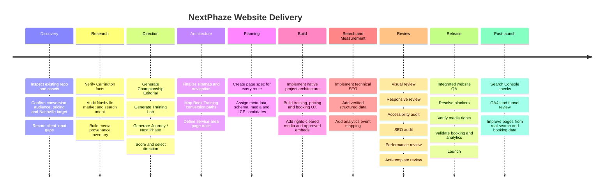
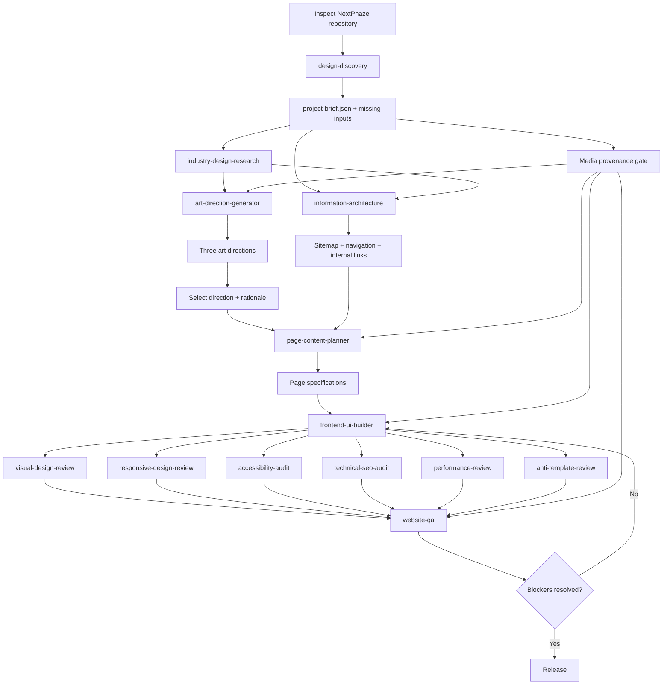

# NextPhaze Website Codex Build Prompt and Implementation Research

## Executive summary

The strongest positioning for the rebuilt NextPhaze site is **training first, Carrington Thompson’s football résumé second**. A visitor should understand what training is offered, what it costs, where it is offered, and how to book before the site asks them to care about Carrington’s playing history. His Western Michigan, Northwood, and West Michigan Ironmen career should function as evidence that supports the coaching offer, not as the product itself.

That distinction matters in Nashville. Current sports-performance competitors typically lead with speed, agility, assessment, position training, youth development, or coach expertise. Six1Five emphasizes speed mechanics and strength progression; DiamondFit emphasizes data-driven speed and assessments; D1 West Nashville uses a coach’s college/NFL background as credibility; QB Country offers year-round receiver route work; and marketplace pages such as Athletes Untapped aggressively target phrases such as football training, private football coaching, route running, speed, and agility in Nashville. citeturn17view0turn17view1turn17view2turn17view3turn17view4

The recommended conversion hierarchy is therefore:

**Training outcome → Training option → Price → Book Training → Local relevance → Coach credibility → Career story/media**

Carrington’s verified story is strong enough that it does not need embellishment. Western Michigan’s records identify him as #15, a 6'2" wide receiver from Houston, and credit him with 42 receptions, 637 yards and six touchdowns in 2016. His official WMU bio credits his prior Northwood career with 89 catches, 1,210 yards and 10 touchdowns. His WMU 2015 and 2016 production therefore produces verified WMU totals of 50 receptions, 726 yards and eight touchdowns, and combined Northwood plus WMU totals of 139 receptions, 1,936 yards and 18 touchdowns. citeturn14search1turn24search0turn24search3

His strongest verified game-level proof includes **8 receptions, 177 yards and two touchdowns against Eastern Michigan**, including a career-long 51-yard reception, and **6 receptions, 72 yards and a touchdown in the 2016 MAC Championship Game against Ohio**. The Eastern Michigan line comes directly from WMU’s official recap. citeturn24search1turn3search1

His Ironmen career also gives the site useful post-college proof. Local Sports Journal reports that he caught **five touchdown passes in the 2018 MPIF championship game** and later identifies him as the **2018 MPIF Offensive Rookie of the Year**. The same publication documented a game-winning touchdown catch with three seconds left against the Muskegon Mustangs in 2019 and a three-catch, 66-yard, two-touchdown performance against Indianapolis. citeturn12search3turn15view2turn12search1turn12search2

The media plan should be deliberately conservative. FOX 17’s terms state that its service content, including photos and videos, cannot generally be reproduced or commercially exploited without permission, although its own video-player embedding can be authorized in certain instances. Local Sports Journal labels its site content “all rights reserved,” and its photographs identify individual photographers. Western Michigan specifically directs people wishing to purchase athletic photographs to credentialed photographers. Those sources should therefore be treated as **research leads, external links, conditional official embeds, or permission-request targets**, not as a pool of images to download. citeturn22view0turn13view0turn23search15

The current `FlintstoneSEO/codex-frontend-design-agent` architecture is well suited to this project. Its `AGENTS.md` requires a completed brief, three genuinely different art directions, a selected direction with rationale, an approved information architecture, and a page specification before coding. It also mandates WCAG 2.2 AA, deliberate mobile composition, Core Web Vitals targets, metadata/schema/crawlability, and integrated review. fileciteturn1file0L2-L2 The current skill set includes discovery, industry research, art-direction generation, IA, page planning, UI implementation, responsive review, accessibility, technical SEO, performance, anti-template review, and website QA. It does **not** currently expose a dedicated `media-licensing` skill, so media licensing should be implemented as a project-level provenance gate rather than pretending that skill exists. fileciteturn5file0L2-L2

Several implementation facts remain intentionally unresolved:

| Required fact | Status |
|---|---|
| Target market | **Confirmed: Nashville, TN** |
| Primary CTA | **Confirmed: Book Training** |
| Group price | **Confirmed: $30** |
| One-on-one price | **Confirmed: $60** |
| Exact Nashville training venue/address | **[NEEDS CLIENT INPUT]** |
| Whether business is storefront, hybrid, or service-area only | **[NEEDS CLIENT INPUT]** |
| Exact surrounding cities/neighborhoods actually served | **[NEEDS CLIENT INPUT]** |
| Phone number and public booking email | **[NEEDS CLIENT INPUT]** |
| Production domain | **[NEEDS CLIENT INPUT]** |
| Booking/scheduling platform | **[NEEDS CLIENT INPUT]** |
| Session durations | **[NEEDS CLIENT INPUT]** |
| Athlete age ranges | **[NEEDS CLIENT INPUT]** |
| Exact weekly availability | **[NEEDS CLIENT INPUT]** |
| Cancellation/rescheduling policy | **[NEEDS CLIENT INPUT]** |
| Carrington-owned social profile URLs | **[NEEDS CLIENT INPUT]** |
| Rights to existing Carrington/WMU/Ironmen photos | **[NEEDS CLIENT INPUT / RIGHTS AUDIT]** |
| GA4 Measurement ID | **[NEEDS CLIENT INPUT]** |
| Google Business Profile status | **[NEEDS CLIENT INPUT]** |

Those should remain visible unknowns rather than be guessed, which is also consistent with the design agent’s truthfulness rules. fileciteturn1file0L2-L2

## Paste-ready Codex prompt

The prompt below is written specifically for the current design-agent workflow. The repository requires discovery and planning artifacts before implementation, and its UI builder is instructed to preserve an existing project’s native platform rather than replacing it with standalone HTML. For a genuinely new content-driven sports/local-service site with no required platform, the current agent guidance defaults to Astro. fileciteturn1file0L2-L2 fileciteturn10file0L2-L2

```text
NEXT PHAZE ATHLETIC TRAINING
RESEARCH-BACKED CODEX WEBSITE BUILD PROMPT

PROJECT
NextPhaze Athletic Training
Coach: Carrington Thompson
Primary target market: Nashville, Tennessee
Primary conversion: Book Training
Confirmed pricing:
- Group Training: $30
- 1-on-1 Training: $60

DESIGN AGENT REPOSITORY
https://github.com/FlintstoneSEO/codex-frontend-design-agent

CORE BUSINESS PRIORITY

This is a TRAINING BUSINESS website, not a football résumé website.

The site's first job is to make athletes and/or their parents understand:
1. what NextPhaze training offers,
2. why the training is valuable,
3. where training is available,
4. what it costs,
5. how to book.

Carrington Thompson's playing career is secondary proof of credibility.

Do not make the hero, opening viewport, or primary navigation primarily about Western Michigan, football statistics, the Cotton Bowl, awards, or Carrington's past career.

The correct hierarchy is:

TRAINING OUTCOME
→ TRAINING SERVICES
→ PRICING
→ BOOK TRAINING
→ NASHVILLE RELEVANCE
→ COACH CREDIBILITY
→ CAREER PROOF AND MEDIA

Carrington's career should strengthen the offer after visitors understand the service.

PRIMARY CTA

Use the exact primary action language:

BOOK TRAINING

It must be visually dominant and consistently implemented in the header, appropriate service sections, pricing area, mobile conversion treatment, and final CTA.

Do not create competing primary calls to action such as "Learn More," "Get Started," "Start Your Journey," and "Contact Us" with equal visual weight.

Secondary contextual actions are permitted, but "Book Training" is the primary conversion.

SOURCE-OF-TRUTH RULE

Before touching implementation:

1. Read the target site's complete repository.
2. Read its AGENTS.md files and project instructions.
3. Inspect framework, package manager, routing, components, content model, styles, deployment configuration, CMS, forms, booking integrations, analytics, current assets, and local validation commands.
4. Read the existing NextPhaze content/research brief if it is present in the project.
5. Use this prompt as the updated strategic brief where it supersedes older project assumptions.
6. Nashville, TN is now an approved target market. Older documentation that lists location as unknown is superseded by this prompt.
7. Exact training address, precise service areas, booking provider, session length, phone, hours, age groups, and other unresolved details remain unknown unless they are verified elsewhere in the project.
8. Never fabricate missing client data.

Use the project's current framework if one already exists.

Do not replace a working Astro, React, Next.js, Wix, Shopify, WordPress, or other implementation with standalone HTML.

If this is a genuinely new marketing site and there is no requested platform or existing architecture, follow the design-agent repository's platform guidance.

NON-NEGOTIABLE DESIGN-AGENT PROCESS

Follow the repository's required planning sequence.

DO NOT CODE THE SITE until the following exist:

1. Completed project brief with explicit unknowns and assumptions.
2. Industry/competitor design research.
3. Three substantially different art directions.
4. Selected art direction plus decision rationale.
5. Approved information architecture.
6. Page specification for each page before that page is implemented.

Use the relevant skills in the repository rather than bypassing them.

Required skill workflow:

- design-discovery
- industry-design-research
- art-direction-generator
- information-architecture
- page-content-planner
- frontend-ui-builder
- visual-design-review
- responsive-design-review
- accessibility-audit
- technical-seo-audit
- performance-review
- anti-template-review
- website-qa

IMPORTANT MEDIA-SKILL NOTE

The current repository does not expose a dedicated "media-licensing" skill in its primary skills directory.

Do not pretend a media-licensing skill exists.

Instead, implement a required MEDIA GOVERNANCE GATE across discovery, page planning, implementation, and QA.

Create:

media-provenance.md

before importing or embedding online third-party media.

Also create/update:

templates/design-decision-log.md

for consequential assumptions.

TRUTHFULNESS

Never invent:

- testimonials,
- athlete results,
- ratings,
- certifications,
- awards,
- facilities,
- addresses,
- service areas,
- training schedules,
- age groups,
- professional playing history,
- NFL/AFL/IFL experience,
- statistics,
- media rights,
- partnerships,
- phone numbers,
- social profiles,
- booking URLs.

Use:

[NEEDS CLIENT INPUT: explanation]

for unresolved business facts.

Use:

[PLACEHOLDER: explanation]

only for temporary implementation copy or temporary presentation assets.

Do not ship visible placeholders to production.

VERIFIED COACH CARRINGTON FACTS

The following facts have been researched and may be used accurately, subject to normal editorial wording.

IDENTITY
- Carrington Thompson
- Western Michigan University wide receiver
- Jersey #15
- 6'2", 176 lbs on the 2016 WMU roster
- Houston, Texas
- Transferred to Western Michigan after Northwood University

WESTERN MICHIGAN
2015:
- 8 receptions
- 89 receiving yards
- 2 receiving touchdowns

2016:
- 42 receptions
- 637 receiving yards
- 6 receiving touchdowns
- 15.17 yards per reception

WMU documented totals:
- 50 receptions
- 726 receiving yards
- 8 receiving touchdowns

NORTHWOOD
Official WMU biography credits Carrington's Northwood career with:
- 89 receptions
- 1,210 receiving yards
- 10 receiving touchdowns
- 13.6 yards per catch

COMBINED COLLEGIATE TOTALS
Northwood + Western Michigan:
- 139 receptions
- 1,936 receiving yards
- 18 receiving touchdowns

Whenever these combined totals are shown, label them explicitly as:
"Collegiate totals across Northwood and Western Michigan"
or equivalent.

Do NOT present 1,936 yards as a Western Michigan statistic.

2016 TEAM/CREDENTIAL CONTEXT
Carrington was a member of Western Michigan's historic 2016 team:
- MAC Champion
- Cotton Bowl team
- #15 wide receiver

CAREER PERFORMANCE VS EASTERN MICHIGAN
October 22, 2016:
- 8 receptions
- 177 receiving yards
- 2 receiving touchdowns
- career-long 51-yard reception

MAC CHAMPIONSHIP VS OHIO
December 2, 2016:
- 6 receptions
- 72 receiving yards
- 1 receiving touchdown

NORTHWOOD / WMU STORY
Use the path as a development story where relevant:
Houston → Northwood → Western Michigan → championship season → professional indoor football → NextPhaze.

Do not turn this sequence into the homepage's primary value proposition.

WEST MICHIGAN IRONMEN
Verified:
- Played for West Michigan Ironmen
- Helped win the 2018 Midwest Professional Indoor Football League championship
- Caught five touchdown passes in the championship game
- Named 2018 MPIF Offensive Rookie of the Year
- Continued with West Michigan in 2019 in the American Arena League
- Scored a game-winning touchdown with three seconds remaining against the Muskegon Mustangs in May 2019
- Recorded 3 catches, 66 yards and 2 touchdowns against Indianapolis in June 2019

SAFE POST-COLLEGE WORDING
"Professional indoor and arena football experience with the West Michigan Ironmen"

DO NOT CLAIM specific AFL or IFL playing experience unless the client supplies verifiable evidence.

FOX17 reported interest from the Arena Football League and Canadian Football League. Interest is not the same as having played in those leagues.

VERIFICATION SOURCES

Western Michigan official player bio:
https://wmubroncos.com/sports/football/roster/carrington-thompson/4346

Western Michigan 2016 cumulative statistics:
https://wmubroncos.com/sports/football/stats/2016

Western Michigan vs Eastern Michigan:
https://wmubroncos.com/news/2016/10/22/football-no-20-wmu-keeps-perfect-record-in-tact-fights-past-emu.aspx

Western Michigan MAC Championship:
https://wmubroncos.com/news/2016/12/2/football-broncos-improve-to-13-0-with-first-mac-championship-since-1988.aspx

Sports Reference:
https://www.sports-reference.com/cfb/players/carrington-thompson-1.html

Local Sports Journal 2018 championship:
https://localsportsjournal.com/2018/04/ironmen-hold-off-late-midway-rally-win-mpif-championship-game-68-44/

Local Sports Journal 2019 season preview / Offensive Rookie of Year:
https://localsportsjournal.com/2019/03/new-league-same-goal-ironmen-open-on-saturday-prepared-to-push-for-another-title/

Local Sports Journal game-winning catch:
https://localsportsjournal.com/2019/05/video-west-michigan-ironmen-hold-on-in-qb-shootout-with-the-muskegon-mustangs/

Local Sports Journal Indianapolis performance:
https://localsportsjournal.com/2019/06/ironmen-warm-up-for-the-playoffs-with-a-62-12-victory-over-indianapolis-enforcers/

FOX17 profile:
https://www.fox17online.com/2019/05/28/carrington-thompson-chases-football-dream-with-ironmen

MEDIA STRATEGY

We want authentic Carrington media when legal and technically appropriate.

Priority order:

1. Client-owned, rights-cleared NextPhaze training photos/video.
2. Client-owned, rights-cleared historical Carrington photos/video.
3. Explicitly licensed third-party photography.
4. Official publisher/platform embeds where embedding is actually offered.
5. External media links/cards to credible coverage.
6. Purpose-built placeholders until permission is obtained.

Do not:

- scrape photographs,
- download news photography,
- save WMU images and republish them without rights confirmation,
- hotlink third-party image URLs,
- use screenshots of publisher pages as a workaround,
- rehost FOX17 footage,
- rehost Local Sports Journal video,
- copy third-party thumbnails into the project without rights confirmation,
- assume that an image being online means commercial use is permitted.

Create media-provenance.md before implementation.

Every third-party candidate should record:
- internal asset ID,
- source/publisher,
- source URL,
- asset type,
- creator/photographer when known,
- copyright/rightsholder when known,
- ownership/license status,
- permission evidence,
- embed method,
- whether direct linking is acceptable,
- approved usage,
- prohibited usage,
- project route/section,
- local file path if rights-cleared,
- alt text,
- date rights were checked,
- notes.

Use a rights status enum:
- owned
- licensed
- official-embed
- link-only
- permission-pending
- rejected

No third-party image may enter the production asset folder unless its status is "owned" or "licensed."

Media with "official-embed" status must be embedded using the publisher/platform-provided embed mechanism.

"link-only" media may be represented using original site typography/components and a text link. Do not copy the publisher's thumbnail unless its reuse rights are separately established.

MEDIA LEADS

WMU player page:
https://wmubroncos.com/sports/football/roster/carrington-thompson/4346

Use:
- fact verification,
- potential external source link,
- identify possible photo/licensing route.

Do not assume roster photography can be copied.

WMU photo purchasing guidance:
https://wmubroncos.com/sports/2017/4/5/purchase-athletic-photos

Use this as a lead for acquiring legitimate historical photography from WMU credentialed photographers.

FOX17:
https://www.fox17online.com/2019/05/28/carrington-thompson-chases-football-dream-with-ironmen

FOX17/Scripps terms restrict reuse of its photos, video, and other service content without permission, although publisher-enabled video embedding can be permitted in some instances.

Default status:
LINK-ONLY

Upgrade to OFFICIAL-EMBED only if the live publisher page exposes an official embed function/code and that embed functions successfully.

Local Sports Journal championship:
https://localsportsjournal.com/2018/04/ironmen-hold-off-late-midway-rally-win-mpif-championship-game-68-44/

Default status:
LINK-ONLY / PERMISSION-PENDING for photographs.

Local Sports Journal Mustangs game:
https://localsportsjournal.com/2019/05/video-west-michigan-ironmen-hold-on-in-qb-shootout-with-the-muskegon-mustangs/

This page includes photographs credited to Joe Lane, including Carrington #15 and the game-winning catch.

Do not republish those images without permission.

Local Sports Journal Indianapolis:
https://localsportsjournal.com/2019/06/ironmen-warm-up-for-the-playoffs-with-a-62-12-victory-over-indianapolis-enforcers/

This page contains photography credited to Leo Valdez.

Do not republish it without permission.

MLive YouTube candidate:
https://www.youtube.com/watch?v=lsJL8-dRAYM

Title:
"Former WMU receiver Carrington Thompson Sr. is a primary playmaker for West Michigan Ironmen"

Uploader surfaced in search as @mlive2.

Treat this as a CONDITIONAL OFFICIAL PLATFORM EMBED candidate.

Before using:
- verify the video is still live,
- verify embedding has not been disabled by the publisher,
- use YouTube's player rather than downloading/rehosting it,
- record source and verification date in media-provenance.md.

LOCAL BUSINESS POSITIONING

Target:
Nashville, Tennessee

The site should communicate Nashville relevance naturally and early.

Recommended homepage language direction:

"Performance Training Built for the Next Phase"

Supporting language can clarify:
- athletic development,
- speed,
- agility,
- football and position-specific work,
- one-on-one and group options,
- Nashville, Tennessee.

Do not keyword-stuff every heading.

Do not represent NextPhaze as having a Nashville storefront, facility, gym, field, or street address unless verified.

Location model remains:
[NEEDS CLIENT INPUT: fixed facility, hybrid business, or service-area business]

PRIMARY LOCAL SEARCH THEMES

Use these as search-intent clusters, not as a requirement to repeat exact-match phrases unnaturally:

Core:
- athletic training Nashville TN
- sports performance training Nashville
- sports performance coach Nashville
- private athletic training Nashville
- athletic development Nashville

Speed and movement:
- speed training Nashville TN
- speed and agility training Nashville
- agility training Nashville TN
- sports speed coach Nashville

Football:
- football training Nashville TN
- private football training Nashville
- private football coach Nashville
- wide receiver training Nashville
- WR coach Nashville TN
- route running training Nashville
- football speed training Nashville
- position-specific football training Nashville

Conversion:
- one-on-one athletic training Nashville
- group athletic training Nashville
- private sports training Nashville

Conditional terms, only if service is confirmed:
- youth athletic training Nashville
- youth football training Nashville
- high school football training Nashville
- off-season football training Nashville

Do not invent keyword search volumes.

Do not claim these are the highest-volume phrases unless actual current volume data from a supported keyword dataset is obtained.

COMPETITIVE LANDSCAPE

No specific competitor was provided by the client.

Treat the following as a non-exhaustive research sample, not as a definitive direct-competitor list:

Six1Five Sports Training
https://615sportstraining.com/speed-and-strength

Observed positioning:
speed mechanics, agility, strength, athlete progression.

DiamondFit Performance Nashville
https://diamondfitperformance.com/nashville/services/speed-training/

Observed positioning:
data-driven speed, agility, performance, athlete assessment.

D1 West Nashville
https://d1training.com/article/former-college-nfl-coach-kenan-smith-leads-through-action-at-d1-west-nashville--d1-daily

Observed positioning:
established training brand plus high-level coach credibility.

QB Country
https://qbcountry.com/wr-te-training/

Observed positioning:
year-round receiver/TE route and catching work tied to QB training.

Athletes Untapped Nashville football page
https://athletesuntapped.com/browse/football/tennessee/nashville-tn/

Observed positioning:
private football coaching, position-specific training, route running, speed/agility, localized landing-page content.

Do not copy the identifiable design, information sequence, illustrations, language, or page composition of any competitor.

Use competitor research to identify:
- expected information,
- missing information,
- user anxieties,
- conversion conventions,
- differentiation opportunities.

LIKELY NEXTPHAZE DIFFERENTIATION TO TEST

Treat this as a strategy hypothesis, not fabricated customer research:

- direct access to the coach whose experience is being presented,
- transparent $30 group / $60 1-on-1 pricing,
- football and wide receiver expertise plus general speed/agility development,
- championship-level playing experience as supporting credibility,
- straightforward booking,
- development story that matches the "NextPhaze" name.

THREE REQUIRED ART DIRECTIONS

Generate exactly three substantially different structural art directions using the art-direction-generator skill.

The names/strategic starting points must be:

A. CHAMPIONSHIP EDITORIAL

Concept:
A sophisticated sports editorial system inspired by the authority and pacing of high-quality sports journalism, not by a team fan site.

Traits:
- assertive editorial typography,
- asymmetric columns,
- strong image cropping,
- large but restrained pull statistics,
- documented career media as secondary story modules,
- raw training imagery mixed with editorial proof,
- visible Nashville/service offer before career content,
- fewer generic cards,
- dramatic whitespace and hierarchy.

Risk:
If historical media rights are weak, this direction could become visually under-supported.

Do not use WMU colors as the entire brand identity merely because Carrington played there.

B. TRAINING LAB

Concept:
A precise athlete-development system focused on movement, drills, repetition, progression, and coaching detail.

Traits:
- strong modular grid,
- session/pricing information prominent,
- drill/process language,
- movement diagrams or abstract training notation where original,
- detailed micro-interactions,
- controlled typography,
- visual rhythm inspired by cones, field markings, routes, timing, and footwork,
- credibility integrated as evidence rather than hero narrative.

Important:
Do not fabricate times, combine metrics, athlete scores, improvement percentages, performance dashboards, or testing data.

This is a likely strong fit for a training-first business, but the agent must score it rather than automatically select it.

C. JOURNEY / NEXT PHASE

Concept:
A brand system based on athlete progression from current phase to next phase.

Traits:
- progression/pathway composition,
- intentional phase markers,
- training categories mapped to development stages,
- Carrington's own journey used as a secondary proof-of-concept,
- motion may reinforce progression when reduced-motion support is respected,
- strong narrative flow without becoming a personal biography.

Risk:
Career storytelling could overwhelm the training offer if hierarchy is not controlled.

ART-DIRECTION REQUIREMENTS

For each direction document define:
- business strategy,
- emotional tone,
- typography system,
- color philosophy,
- layout logic,
- image behavior,
- section grammar,
- component behavior,
- navigation,
- CTA treatment,
- motion,
- mobile composition,
- accessibility considerations,
- performance implications,
- media dependencies,
- differentiation,
- risks,
- score against business fit.

The three directions must differ in composition, density, content emphasis, image behavior, component grammar, and interaction treatment.

A palette/font swap is not sufficient.

Recommend one direction after comparison and record the rationale.

INFORMATION ARCHITECTURE BASELINE

Use the information-architecture skill.

Treat this as the baseline to evaluate and refine:

/
Home

/training/
Training overview

/training/one-on-one/
1-on-1 Training

/training/group/
Group Training

/training/speed-agility/
Speed & Agility Training

/training/wide-receiver/
Wide Receiver / Football Skill Training

/coach-carrington/
Coach Carrington Thompson

/book-training/
Book Training

/areas/[verified-service-area]/
Conditional local service-area page template

/privacy/
Privacy Policy

Optional based on actual business requirements:
/terms/

Do not create a separate page for every Nashville suburb or neighborhood solely to target keywords.

Service-area pages may be created only when:
- the area is actually served,
- the client confirms it,
- the page has a distinct local purpose,
- the page has unique useful content,
- it can answer area-specific customer questions,
- it does not merely replace a city name in duplicated text.

The homepage should be the primary broad Nashville landing page.

Do not create "/nashville/" simply to duplicate the homepage's Nashville intent unless the final IA identifies a genuinely different purpose.

NAVIGATION

Recommended primary navigation to test:

Training
Pricing
Coach Carrington
Locations / Service Area
Book Training

"Book Training" should be implemented as the primary action.

Pricing can scroll to a clear pricing section if a separate pricing route is unnecessary.

Keep Carrington's biography one level below training in hierarchy.

HOMEPAGE CONTENT PRIORITY

The first portion of the homepage should prioritize:

1. Clear outcome/value proposition
2. Nashville context
3. Book Training
4. Training options
5. Transparent pricing
6. How training works / what athletes develop
7. Appropriate trust proof
8. Coach Carrington introduction
9. Selected career credibility
10. Testimonials/results only if verified
11. Service area
12. FAQ
13. Final Book Training CTA

The hero should not read like:
"Meet Carrington Thompson, former Western Michigan wide receiver..."

Prefer training-first language.

Example content direction, not mandatory final copy:

H1:
Athletic Training Built for Your Next Phase

Support:
Speed, agility, football skill development, and focused coaching in Nashville, Tennessee.

Pricing proof:
Group Training $30
1-on-1 Training $60

Primary CTA:
Book Training

CAREER CREDIBILITY PRESENTATION

Use a compact proof section or coach section.

Possible hierarchy:

Coach Carrington Thompson
Former Western Michigan #15
2016 MAC Champion
Cotton Bowl Team Member
2018 MPIF Champion
2018 MPIF Offensive Rookie of the Year

Supporting collegiate numbers may appear deeper in the coach page:

1,936
Collegiate Receiving Yards
Northwood + Western Michigan

139
Collegiate Receptions
Northwood + Western Michigan

18
Collegiate Receiving Touchdowns
Northwood + Western Michigan

Do not place a wall of career statistics before users see training options/pricing.

One optional performance callout:

8 REC
177 YDS
2 TD
vs. Eastern Michigan
October 22, 2016

This belongs as secondary credibility or storytelling content.

PAGE SPECIFICATIONS

Before implementing each route, use page-content-planner.

Each page specification must define:
- page objective,
- primary audience,
- primary user question,
- search intent,
- conversion,
- title,
- meta description,
- H1,
- hierarchy,
- proof requirements,
- internal links,
- media,
- structured data,
- mobile behavior,
- accessibility notes,
- LCP candidate,
- performance considerations,
- missing client input,
- acceptance criteria.

Do not build pages with filler sections.

TRAINING PAGE CONTENT

Services currently safe to foreground based on the approved brief:
- group training,
- one-on-one training,
- speed/agility development,
- wide-receiver / football skill development.

If "sport-specific training" is retained as a service, define it clearly rather than using a vague catch-all card.

Do not promise measurable outcomes unless verified.

Do not write:
"guaranteed faster"
"proven to increase speed by X%"
"get recruited"
"earn a scholarship"
or similar claims without evidence.

PRICING

Make pricing highly visible.

Confirmed:
Group Training: $30
1-on-1 Training: $60

Do not invent:
- package discounts,
- monthly plans,
- membership terms,
- session duration,
- sibling pricing,
- deposits,
- cancellation fees.

Mark those as client inputs if needed.

BOOKING

Booking mechanism:
[NEEDS CLIENT INPUT: booking platform or scheduling workflow]

Inspect the existing repo first.

If a booking provider/integration already exists, preserve and improve it.

If no booking system exists:
- do not invent a fake booking confirmation,
- do not create a front-end-only form that appears to submit when it does not,
- visibly record the blocker,
- implement only what the native architecture can actually process,
- provide a clear integration boundary.

All Book Training buttons must have a real destination before release.

LOCATION / LOCAL SEO

Nashville, TN is confirmed as the primary market.

Still required:
[NEEDS CLIENT INPUT: exact training venue/address]
[NEEDS CLIENT INPUT: service-area business vs hybrid vs customer-facing location]
[NEEDS CLIENT INPUT: verified surrounding areas actually served]

If the business travels to clients or uses non-customer-facing/private locations, do not expose a private home address.

Do not invent Nashville neighborhood pages.

GOOGLE BUSINESS PROFILE

Prepare site/entity data so it can align with a Google Business Profile.

Business name:
NextPhaze Athletic Training

Do not modify the real-world business name with keywords just for SEO.

Location/address/hours/category:
client verification required.

If NextPhaze operates as a service-area business, follow current Google service-area rules when the profile is configured.

LOCAL CITATION PLAN

Prepare an owner checklist for:

- Google Business Profile
- Apple Business Connect
- Bing Places for Business
- Yelp Business Page
- Nashville Area Chamber of Commerce directory if membership/eligibility applies
- Better Business Bureau / BBB of Middle Tennessee if appropriate
- Tennessee Secretary of State business entity information for authoritative business-name consistency
- verified social profiles once supplied

Do not create directory accounts or publish business information that has not been verified.

SEO

Implement:
- exactly one descriptive H1 on normal content pages,
- unique titles,
- unique meta descriptions,
- correct canonical URLs,
- logical internal linking,
- robots directives,
- XML sitemap,
- Open Graph metadata,
- social sharing metadata,
- crawlable server-rendered primary content,
- structured data only from visible verified information.

No hidden keyword blocks.

No fake FAQ questions solely for schema.

No fake reviews or aggregateRating.

Do not create local doorway pages.

STRUCTURED DATA

The homepage may use LocalBusiness JSON-LD after required organization information is verified.

Current safe data:
- name: NextPhaze Athletic Training
- areaServed: Nashville, Tennessee
- pricing offers: $30 group and $60 1-on-1
- URL only when production domain is known
- telephone only when verified
- logo/image only when production asset URL and usage rights are verified

Do not fabricate street address, geo coordinates, hours, ratings, sameAs links, social URLs, or review data.

If NextPhaze has a genuine customer-facing sports facility, evaluate SportsActivityLocation as a more specific schema.org subtype.

If it is a mobile/service-area coaching business without a dedicated public facility, do not imply it has one.

Validate deployed schema.

SERVICE-AREA PAGE RULES

A service-area route should contain genuinely local information such as:
- whether training is available there,
- actual training venue information if verified,
- which services are offered there,
- booking logistics,
- travel/service limitations,
- verified local testimonials where available,
- area-specific questions.

Do not create pages that only replace:
"Nashville"
with
"Franklin"
"Brentwood"
etc.

Exact service areas remain client input.

RESPONSIVE UI

Compose mobile deliberately.

Required baseline:
- no horizontal overflow at 320 CSS px,
- test 375,
- test 390,
- test 768,
- test 1024,
- test 1440.

Book Training should remain easy to reach on mobile.

A restrained sticky mobile Book Training control may be considered if it does not obstruct content or accessibility.

Do not simply stack a desktop composition.

ACCESSIBILITY

Target WCAG 2.2 AA.

Requirements include:
- semantic HTML,
- native controls where possible,
- keyboard navigation,
- visible focus,
- logical headings,
- accessible menu behavior,
- sufficient contrast,
- meaningful alt text,
- decorative media hidden appropriately,
- labeled icon-only controls,
- reduced-motion support,
- no content available only via hover,
- accessible forms,
- useful errors,
- correct autocomplete where relevant,
- captions/transcripts for owned video when possible,
- third-party embedded video must still receive an accessible title.

Use the existing icon system if one exists.

If no established icon system exists, follow the design-agent convention and use the correct Lucide package for the framework.

Do not use emoji as interface icons.

PERFORMANCE

Follow design-agent performance targets.

Target at the 75th percentile:
- LCP <= 2.5 seconds
- INP <= 200 ms
- CLS <= 0.1

Plan performance before building.

Requirements:
- optimize responsive images,
- use modern formats where the stack supports them,
- declare dimensions/aspect ratios,
- identify the LCP asset in page specs,
- do not lazy-load the LCP image,
- lazy-load appropriate below-fold media,
- avoid autoplay historical video as a default,
- avoid shipping third-party video players until users approach/interact where practical,
- minimize client-side hydration,
- avoid unnecessary animation libraries,
- optimize fonts,
- respect the project's asset/performance budgets.

MEDIA EMBEDS

Do not auto-embed every discovered video.

Videos are secondary proof, not homepage infrastructure.

Prefer:
- link card on Coach Carrington page,
- one carefully selected embed if useful and rights/platform rules permit,
- poster/interactivity that does not destroy LCP or mobile performance.

For the MLive YouTube candidate:
https://www.youtube.com/watch?v=lsJL8-dRAYM

An implementation candidate, only after verification, is YouTube's normal embed URL:
https://www.youtube.com/embed/lsJL8-dRAYM

Verify embedding is enabled before shipping.

Do not download the video.

For FOX17:
do not invent an iframe URL.
Use a publisher-provided official embed only if the live page explicitly supplies one.
Otherwise link to the FOX17 profile.

For Local Sports Journal:
default to external links until an official reusable embed or permission is verified.

ANALYTICS

Preferred measurement plan:
Google Analytics 4 plus Google Search Console.

Inspect the project for an existing analytics implementation first.

Do not add duplicate analytics libraries.

Required owner input:
[NEEDS CLIENT INPUT: GA4 measurement ID]
[NEEDS CLIENT INPUT: consent/privacy requirements]
[NEEDS CLIENT INPUT: external booking provider]

Recommended event map:

book_training_click
Trigger:
Primary Book Training CTA click.

Parameters:
- page_location
- cta_location
- training_type if known

form_start
Use GA4/native enhanced measurement where suitable.

form_submit
Use only on actual successful form submission.

generate_lead
Trigger only after a genuine lead submission or confirmed booking-lead handoff.

phone_click
Trigger on tel link.

email_click
Trigger on mailto link.

media_outbound_click
Trigger on FOX17, WMU, LSJ, or other external-media links.

booking_provider_outbound
Trigger if Book Training sends users to an external scheduling service.

Do not call an outbound click "booking_complete."

If the booking provider exposes a real confirmation callback or cross-domain measurement integration, implement actual completion measurement then.

Mark the most meaningful genuine lead/booking event as a GA4 key event.

Set up Search Console after domain verification and submit/test sitemap.

MEDIA PROVENANCE QA GATE

Before release:

No third-party media can have:
rights_status = unknown

Every visible third-party item must resolve to:
- owned,
- licensed,
- official-embed,
- or link-only.

permission-pending assets cannot ship as copied/rehosted assets.

rejected assets must not exist in production bundles.

Check CSS for remote background-image URLs.

Check HTML/JS/content files for direct third-party image URLs.

Check public/assets directories for copied news imagery with no provenance record.

COMPETITOR / ANTI-TEMPLATE QA

Run industry-design-research before art direction.

After implementation run anti-template-review.

Specifically test whether the site has fallen into generic AI marketing patterns:
- oversized centered hero by default,
- gradient background with no rationale,
- generic glass cards,
- repetitive three-card grids,
- arbitrary pills,
- excessive rounded rectangles,
- stock-like synthetic athletes,
- copy such as "Unlock Your Potential" with no brand-specific meaning,
- repeated icon-card sections,
- career stats used as decorative filler.

The NextPhaze identity should still be recognizable if the logo is removed.

FLINTSTONE SEO ATTRIBUTION

Follow the design-agent repository requirement.

Include a visible, unobtrusive footer link with the exact visible text:

Design by Flintstone SEO

Target:
https://www.flintstoneseo.com/

Place it with secondary/legal footer content.

Do not hide it.

QA SEQUENCE

After implementation, run:

1. visual-design-review
2. responsive-design-review
3. accessibility-audit
4. technical-seo-audit
5. performance-review
6. anti-template-review
7. website-qa

Every issue must use the repository's required defect format:
- severity,
- element/file,
- viewport/route/state,
- observed problem,
- evidence,
- exact recommended change,
- reason,
- expected outcome,
- verification method.

Fix blockers and high-severity issues and retest.

Do not merely produce audit reports while leaving critical defects unfixed.

CORE QA JOURNEYS

Test:

Visitor lands on homepage
→ understands training
→ sees pricing
→ clicks Book Training
→ reaches working booking flow.

Visitor wants one-on-one training
→ finds 1-on-1 page
→ understands $60 price
→ books.

Visitor wants group training
→ finds group page
→ understands $30 price
→ books.

Visitor searches for Nashville training
→ lands on appropriate local/service page
→ sees actual local relevance
→ does not encounter fabricated facility/address information
→ books.

Visitor wants to evaluate coach
→ reaches Coach Carrington
→ sees verified career proof
→ can visit reputable source/media links
→ can return directly to Book Training.

REQUIRED OUTPUT ARTIFACTS

Create or update:

- project-brief.json
- missing-input register
- industry research artifact
- three art-direction documents
- selected art-direction decision/rationale
- templates/design-decision-log.md
- information architecture / route table
- internal-link map
- page specification for every implemented route
- media-provenance.md
- analytics-event-map.md
- SEO metadata map
- production website implementation
- responsive screenshots/evidence
- accessibility audit
- technical SEO audit
- performance review
- anti-template review
- final website QA report
- release checklist
- README/run/deployment notes where appropriate

PRODUCTION DONE DEFINITION

The site is not finished merely because pages render.

It is finished only when:

- services are visibly the primary product,
- Nashville positioning is accurate,
- $30 group pricing is correct,
- $60 one-on-one pricing is correct,
- Book Training works,
- Carrington's career is secondary proof rather than the primary offer,
- no unsupported AFL/IFL playing claim appears,
- no fabricated business fact appears,
- no unlicensed third-party image has been copied into the project,
- media-provenance.md is complete,
- every media embed/link has a documented status,
- responsive states have been reviewed,
- keyboard use works,
- WCAG issues have been addressed,
- metadata is unique,
- canonical/sitemap/robots behavior is valid,
- structured data matches visible verified content,
- service-area pages are not doorway pages,
- analytics integration is implemented or visibly blocked by a missing ID,
- booking tracking does not claim conversions it cannot observe,
- performance has been tested,
- anti-template review has been completed,
- website QA has produced evidence,
- no [PLACEHOLDER] values remain in production,
- unresolved [NEEDS CLIENT INPUT] items that block truthfulness or critical functionality prevent release rather than being guessed.

DESIGN DECISION TO PROTECT THROUGHOUT THE BUILD

NextPhaze is not selling Carrington Thompson's past.

NextPhaze is selling an athlete's next phase.

Carrington's past is evidence that gives the training offer credibility.

Build the site accordingly.
```

## Verified career and media provenance

The career material below is the amount of sports history I would authorize the design agent to treat as verified site content without requiring Carrington to prove it again. Western Michigan is the strongest source for collegiate facts, Sports-Reference is useful as an independent cross-check, and Local Sports Journal and FOX17 are the strongest located sources for the Ironmen period. citeturn14search1turn24search0turn24search3turn15view1turn15view2

| Claim | Verified result | Website treatment | Source |
|---|---:|---|---|
| WMU jersey | **#15** | Safe | WMU roster citeturn14search1 |
| WMU position | **Wide receiver** | Safe | WMU roster citeturn14search1 |
| 2016 roster size | **6'2", 176 lbs** | Optional, biography only | WMU roster citeturn14search1 |
| 2015 WMU receiving | **8 REC, 89 YDS, 2 TD** | Safe | WMU bio citeturn14search1 |
| 2016 WMU receiving | **42 REC, 637 YDS, 6 TD, 15.17 YPR** | Safe | Official cumulative stats citeturn24search0 |
| WMU totals | **50 REC, 726 YDS, 8 TD** | Safe, derived from official seasons | WMU sources citeturn14search1turn24search0 |
| Northwood | **89 REC, 1,210 YDS, 10 TD** | Safe | WMU bio citeturn14search1 |
| Combined college | **139 REC, 1,936 YDS, 18 TD** | Safe only if labeled Northwood + WMU | Derived from verified institutional totals citeturn14search1turn24search0 |
| Eastern Michigan | **8 REC, 177 YDS, 2 TD, long 51** | Excellent featured proof | Official WMU recap citeturn24search1 |
| MAC Championship vs Ohio | **6 REC, 72 YDS, 1 TD** | Excellent championship proof | Official WMU championship recap citeturn3search1 |
| 2018 Ironmen championship | **MPIF champion; five TD catches in title game** | Safe | Local Sports Journal citeturn12search3 |
| Individual Ironmen award | **2018 MPIF Offensive Rookie of the Year** | Safe | Local Sports Journal 2019 preview citeturn15view2 |
| 2019 Muskegon game | **Game-winning TD with 3 seconds left** | Good story/media link | Local Sports Journal citeturn12search1 |
| 2019 Indianapolis | **3 REC, 66 YDS, 2 TD** | Optional deeper-career proof | Local Sports Journal citeturn12search2 |
| AFL claim | **Interest documented, playing career not verified** | Do not say he played in AFL | FOX17 citeturn15view1 |
| IFL claim | **Not established by researched evidence** | Do not publish without client proof | Current evidence set does not establish it |

FOX17’s profile is especially useful from a brand-story perspective because its coach-source comments describe Carrington not only as a top receiver in that league, but as a leader and someone who enjoyed working with kids. That material can support the transition from player to coach, but it should be paraphrased and linked rather than turned into a long copied quotation. citeturn15view1

I did **not** locate a reliable, complete season-stat database for Carrington’s entire Ironmen career comparable to WMU’s collegiate stat system. For that reason, the website should use the specifically documented Ironmen games/accolades above rather than inventing or attempting to sum a partial professional season from scattered articles.

**Media-provenance research**

The key legal/operational distinction is between **a source page proving a fact** and **a media asset that can be copied onto a commercial site**. FOX17 explicitly reserves rights in its service content and requires prior consent for reproduction except where its own functionality authorizes a use such as certain video embeds. Local Sports Journal displays “all rights reserved,” while its Carrington game galleries identify photographers such as Joe Lane and Leo Valdez. WMU has a dedicated page directing purchasers of athletics photos to credentialed photographers. citeturn22view0turn13view0turn13view2turn23search15

| Source | URL | Asset type | Rights / permission evidence | Embed or link posture | Recommended NextPhaze use |
|---|---|---|---|---|---|
| Western Michigan player profile | https://wmubroncos.com/sports/football/roster/carrington-thompson/4346 | Roster portrait, player page, facts | No reuse license established in research; WMU separately directs users to credentialed photographers for photo purchases. citeturn14search1turn23search15 | **Link: yes. Image copy: permission/license required.** | Source citation on Coach page; pursue licensed portrait/action photo through Carrington or WMU photographer |
| WMU vs Eastern Michigan | https://wmubroncos.com/news/2016/10/22/football-no-20-wmu-keeps-perfect-record-in-tact-fights-past-emu.aspx | Recap, photo gallery lead, game facts | Official page exposes photo-gallery references but no commercial reuse right was established. citeturn24search1 | **Link: yes. Copy: permission required.** | “Career Performance” source link; permission lead for action photo |
| WMU MAC Championship | https://wmubroncos.com/news/2016/12/2/football-broncos-improve-to-13-0-with-first-mac-championship-since-1988.aspx | Recap, championship media lead | Treat under same conservative WMU photo posture | **Link: yes. Reuse: verify first.** | Championship credential source |
| WMU photo purchase information | https://wmubroncos.com/sports/2017/4/5/purchase-athletic-photos | Licensing/acquisition lead | WMU directs users to credentialed photographers for purchasing athletics photos. citeturn23search15 | Not an embed | **Best practical route for acquiring legitimate historical WMU imagery** |
| FOX17 Carrington feature | https://www.fox17online.com/2019/05/28/carrington-thompson-chases-football-dream-with-ironmen | News article, video/still media | Scripps terms reserve text/photo/video rights; reuse generally requires prior consent; video-player embedding may be allowed when publisher functionality provides it. citeturn22view0 | **Default: link-only. Conditional official embed.** | “In the Media” card; official player embed only if publisher currently exposes one |
| Local Sports Journal championship | https://localsportsjournal.com/2018/04/ironmen-hold-off-late-midway-rally-win-mpif-championship-game-68-44/ | Article/photos | Site displays all-rights-reserved posture; no reusable commercial license located. citeturn12search3turn15view2 | **Link-only unless permission acquired** | Verify title-game five-TD achievement; request photo permission separately |
| Local Sports Journal Muskegon | https://localsportsjournal.com/2019/05/video-west-michigan-ironmen-hold-on-in-qb-shootout-with-the-muskegon-mustangs/ | Video-labelled article, photo gallery | Photos identify Joe Lane; site states all rights reserved. citeturn13view0 | **Link-only by default** | Great media card because page includes the game-winning #15 catch; ask LSJ/Joe Lane about licensing |
| Local Sports Journal Indianapolis | https://localsportsjournal.com/2019/06/ironmen-warm-up-for-the-playoffs-with-a-62-12-victory-over-indianapolis-enforcers/ | Video-labelled article, photos | Carrington photo credited to Leo Valdez; site states all rights reserved. citeturn13view2 | **Link-only by default** | Secondary media/career link; ask publisher/photographer if image needed |
| MLive YouTube | https://www.youtube.com/watch?v=lsJL8-dRAYM | Video | Search identifies uploader as `@mlive2`; embedding availability must be tested on the live player. citeturn16search0 | **Conditional platform embed; link otherwise** | Strong candidate for Coach/Media page if embedding remains enabled |

A conditional YouTube implementation candidate is:

```html
<div class="media-embed">
  <iframe
    src="https://www.youtube.com/embed/lsJL8-dRAYM"
    title="Former WMU receiver Carrington Thompson with the West Michigan Ironmen"
    loading="lazy"
    allow="accelerometer; autoplay; clipboard-write; encrypted-media; gyroscope; picture-in-picture"
    allowfullscreen
  ></iframe>
</div>
```

That should only be shipped after the agent confirms the video is still available and permits embedding. The video should never be downloaded into the NextPhaze repository. The discovered search result identifies the video as an MLive upload about Carrington’s Ironmen career. citeturn16search0

FOX17 should be treated differently. Its terms specifically contemplate video-player embedding only in certain publisher-authorized circumstances, so the agent should **not reverse-engineer an iframe or point directly to a media file**. Either use the official embed mechanism exposed by FOX17/Scripps at implementation time, or render a normal external article link. citeturn22view0

A safe link card requires no third-party image:

```html
<article class="media-reference">
  <p class="media-reference__publisher">FOX 17</p>
  <h2>Carrington Thompson Chases Football Dream with Ironmen</h2>
  <a
    href="https://www.fox17online.com/2019/05/28/carrington-thompson-chases-football-dream-with-ironmen"
    target="_blank"
    rel="noopener noreferrer"
  >
    Watch / read the FOX 17 feature
  </a>
</article>
```

**Recommended `media-provenance.md` format**

```md
# NextPhaze Media Provenance

Last reviewed: YYYY-MM-DD
Owner: [NEEDS CLIENT INPUT]

## Rights statuses

Allowed values:

- `owned`
- `licensed`
- `official-embed`
- `link-only`
- `permission-pending`
- `rejected`

## Rules

1. No third-party image, video, thumbnail, screenshot, or audio enters production
   without a provenance record.
2. `owned` and `licensed` assets may be stored locally.
3. `official-embed` assets must use the platform/publisher embed.
4. `link-only` assets may be referenced with a normal external link but must not
   have their third-party thumbnail copied into this project unless separately licensed.
5. `permission-pending` assets do not ship as copied assets.
6. `rejected` assets must not exist in production bundles.
7. Never hotlink a third-party image as a substitute for permission.

## Asset register

| ID | Route / section | Publisher | Source URL | Asset type | Creator / credit | Rights holder | Rights status | Permission evidence | Embed method | Approved use | Prohibited use | Local file | Alt text | Verified date | Notes |
|---|---|---|---|---|---|---|---|---|---|---|---|---|---|---|---|
| media-001 | /coach-carrington/ | WMU Athletics | https://... | Photo | [UNKNOWN] | [UNKNOWN] | permission-pending | None | N/A | Research/link | Copy/hotlink | N/A | N/A | YYYY-MM-DD | Request rights |
| media-002 | /coach-carrington/ | FOX17 | https://... | Video/article | Scripps | Scripps/licensor | link-only | TOS reviewed | External link | Link | Rehost/copy | N/A | N/A | YYYY-MM-DD | Upgrade only if official embed available |
| media-003 | /coach-carrington/ | MLive / YouTube | https://... | Video | MLive | [VERIFY] | official-embed | Player embed verified | YouTube iframe | Embed/link | Download/rehost | N/A | ... | YYYY-MM-DD | Recheck before launch |

## Permission requests

| ID | Contact | Date requested | Permission requested | Response | Restrictions | Evidence file |
|---|---|---|---|---|---|---|

## Release check

- [ ] No `unknown` rights statuses
- [ ] No unlicensed remote image URLs in CSS
- [ ] No copied publisher thumbnails without permission
- [ ] All official embeds still load
- [ ] All link-only destinations return valid responses
- [ ] Alt text is accurate and does not invent context
- [ ] Photographer/source credits are displayed when license requires them
```

## Information architecture and Nashville SEO brief

The Nashville market research suggests NextPhaze should compete at the intersection of **general sports performance, speed/agility, and football-specific private training**, rather than narrowing the entire brand to wide receivers. Six1Five and DiamondFit establish a strong local speed/agility vocabulary; D1 demonstrates how high-level coaching credentials can support a training proposition; QB Country validates receiver/route-running demand as a distinct niche; and Athletes Untapped shows substantial Nashville-specific search content around private football coaching and position training. citeturn17view0turn17view1turn17view2turn17view3turn17view4

This audit is intentionally **non-exhaustive**. No competitors were supplied by the site owner, so these organizations were selected as useful examples surfaced during Nashville research rather than being asserted as NextPhaze’s five direct business competitors.

| Observed Nashville/search competitor | What it emphasizes | Implication for NextPhaze |
|---|---|---|
| Six1Five Sports Training | Speed mechanics, agility, strength, technique, age-segmented programs and recurring membership options. citeturn17view0 | NextPhaze should clearly describe *how* athletes train, but its simpler per-session pricing can be easier to understand |
| DiamondFit Nashville | Data-driven speed, agility, power and an assessment-first conversion path. citeturn17view1 | Do not imitate “data-driven” language unless NextPhaze actually measures data. Differentiate around direct coaching, football transfer and simplicity |
| D1 West Nashville | Established brand plus coach expertise, including college/NFL coaching background. citeturn17view2 | Carrington’s résumé is legitimate credibility, but D1 also shows why credentials should support rather than replace the service proposition |
| QB Country | Year-round receiver work, route-running technique, catches from QBs, 1-on-1/small-group/performance ecosystem. citeturn17view3 | Wide receiver training is a valuable dedicated service page, but should not be the only reason to choose NextPhaze |
| Athletes Untapped | Nashville landing page, private coaching, route running, speed/agility, position-specific football, local coach listings. citeturn17view4 | NextPhaze needs a strong first-party Nashville page and service-specific content instead of relying only on brand/homepage copy |

My strategic inference from this landscape is that NextPhaze can occupy a useful space with **direct coach access + transparent session pricing + speed/agility + football skill expertise + championship-level credibility**. That should be tested in copy/design rather than stated as an objective market superiority claim. citeturn17view0turn17view1turn17view2turn17view3

**Keyword map**

These are qualitative search-intent targets derived from the observed Nashville SERP vocabulary and competitor service language. They are **not keyword-volume estimates**. No proprietary Google Ads, Semrush, Ahrefs, Moz, or similar volume dataset was supplied or used, so the agent must not label these terms “highest volume” or attach fabricated monthly-search figures. citeturn17view0turn17view1turn17view3turn17view4

| Cluster | Suggested targets | Best destination |
|---|---|---|
| Core local | athletic training Nashville TN; sports performance training Nashville; sports performance coach Nashville; private athletic training Nashville | Home + Training |
| Speed | speed training Nashville TN; speed and agility training Nashville; agility training Nashville; sports speed coach Nashville | Speed & Agility |
| Football | football training Nashville TN; private football training Nashville; football coach Nashville; position-specific football training Nashville | Football/WR training |
| WR niche | wide receiver training Nashville; WR coach Nashville TN; route running training Nashville; receiver skills training Nashville | WR training |
| Conversion | one-on-one athletic training Nashville; group athletic training Nashville; private sports training Nashville | 1-on-1 + Group + Book |
| Age-dependent | youth athletic training Nashville; youth football training Nashville; high-school football training Nashville | **Publish only after age groups are confirmed** |
| Seasonal | off-season football training Nashville; football offseason training Nashville | **Publish only if that program is actually offered** |
| Service area | `[verified area] athletic training`; `[verified area] football training`; `[verified area] speed training` | Conditional service-area pages only |

Google’s current Business Profile guidance permits up to **20 service areas**, asks businesses to be specific and accurate, and says the overall service-area boundary generally should not extend more than about two hours’ driving time from the business base. A service-area business that does not receive customers at its address can hide that address and show only its service area. citeturn18search0turn18search1turn18search9

That does **not** mean NextPhaze should create 20 website landing pages. The design-agent’s own IA skill explicitly treats creating pages only to target duplicate city terms as a failure condition. fileciteturn8file0L2-L2 A NextPhaze area page should therefore exist only where Carrington actually trains athletes and where the page can contain genuinely distinct information such as venue/logistics, services available there, booking rules, verified area-specific testimonials, or travel considerations.

**Recommended sitemap and page specifications**

| Route | Business/content priority | Search intent | Primary content | Primary CTA | Suggested title | Suggested meta description |
|---|---|---|---|---|---|---|
| `/` | **Highest** | Broad Nashville athletic/performance training | Training value, Nashville, services, prices, process, brief coach proof, local info | **Book Training** | **Athletic Training in Nashville, TN \| NextPhaze** | **Train for speed, agility, football skills and athletic development with NextPhaze in Nashville. Group training is $30 and 1-on-1 training is $60.** |
| `/training/` | Highest | Sports performance/training comparison | Program overview, who each option is for, development areas, pricing | Book Training | **Sports Performance Training Nashville \| NextPhaze** | **Explore NextPhaze athletic training in Nashville, including speed, agility, football skills, group sessions and focused 1-on-1 coaching.** |
| `/training/one-on-one/` | High | Private trainer / individualized training | What focused coaching includes, who it fits, $60 price, booking steps | Book 1-on-1 Training | **1-on-1 Athletic Training Nashville \| NextPhaze** | **Book focused 1-on-1 athletic training with Coach Carrington Thompson in Nashville for $60 per session.** |
| `/training/group/` | High | Affordable group athlete training | Group format, skill focus, $30 price, what athletes should expect | Book Group Training | **Group Athletic Training Nashville \| $30 Sessions** | **Train with NextPhaze in a group setting for $30 per session. Build speed, movement, football skills and competitive habits in Nashville.** |
| `/training/speed-agility/` | High | Speed/agility coach | Acceleration, footwork, change of direction, movement, game transfer; avoid unverified result promises | Book Training | **Speed & Agility Training Nashville, TN \| NextPhaze** | **Build better movement, acceleration, footwork and change of direction with speed and agility training from NextPhaze in Nashville.** |
| `/training/wide-receiver/` | High niche | WR/route-running/football skill coach | Stance, releases, footwork, routes, catching, position movement, Carrington proof | Book WR Training | **Wide Receiver Training Nashville, TN \| NextPhaze** | **Train receiver footwork, releases, route running and position-specific skills in Nashville with former Western Michigan WR Carrington Thompson.** |
| `/coach-carrington/` | Secondary credibility | Coach research / branded search | Coaching philosophy, WMU #15, Northwood, 2016 team, Ironmen, stats, verified media links | Book Training | **Coach Carrington Thompson \| NextPhaze Nashville** | **Meet NextPhaze coach Carrington Thompson, former Western Michigan #15, MAC Champion and professional indoor football champion.** |
| `/book-training/` | **Highest conversion** | Schedule / booking | Group vs 1-on-1 choice, prices, real scheduler/form, location expectations, policies once verified | Complete booking | **Book Athletic Training in Nashville \| NextPhaze** | **Book NextPhaze training in Nashville. Choose $30 group training or $60 one-on-one coaching and select an available session.** |
| `/areas/[area]/` | Conditional | Verified nearby-area intent | Unique local availability/logistics, services, local proof, booking | Book Training | **Athletic Training in [Area], TN \| NextPhaze** | **Train with NextPhaze in [Area] with speed, agility and football development options. View availability and book a session.** |
| `/privacy/` | Required depending data stack | Legal | Actual privacy practices, analytics/forms/cookies | None | **Privacy Policy \| NextPhaze** | Usually no marketing-focused description needed |
| `/terms/` | Conditional | Legal | Booking/payment/cancellation terms if appropriate | None | **Terms \| NextPhaze** | Usually no marketing-focused description needed |

The design agent should not take the meta examples as immutable copy. Its page-content-planner is designed to specify objective, audience, conversion, search intent, metadata, H1, proof, internal links, schema, media, mobile behavior, accessibility, performance and acceptance criteria per route. fileciteturn9file0L2-L2

**Recommended navigation**

`Training` | `Pricing` | `Coach Carrington` | `Service Area` | **Book Training**

I would avoid putting “Career” in the primary navigation. The career is a reason to trust the trainer, not a primary visitor task.

The homepage should also handle broad Nashville intent rather than creating a redundant `/nashville/` landing page. Service-area routes should be added only after the exact areas where Carrington actually trains are supplied and can support unique content. That follows both Google’s preference for accurate service areas and the design agent’s prohibition against duplicate local doorway pages. citeturn18search0turn18search1 fileciteturn8file0L2-L2

## Design-agent implementation plan

The current agent workflow is unusually helpful here because it prevents a common mistake: opening the site repository and immediately generating a stylish sports homepage before business facts, media rights, IA and conversion architecture are settled. `design-discovery` specifically requires reading existing files first, generating `project-brief.json`, identifying missing inputs and avoiding invented facts. fileciteturn6file0L2-L2 The art-direction skill then requires three structurally distinct systems rather than palette swaps. fileciteturn7file0L2-L2

| Phase / skill | NextPhaze-specific work | Required artifact / exit condition |
|---|---|---|
| `design-discovery` | Inspect site repo, old NextPhaze brief, assets, booking, framework, content, analytics. Normalize Nashville as confirmed target. Mark address, service areas, phone, hours, ages, duration, booking provider and rights as unknown until verified. | `project-brief.json`, missing-input register; primary conversion confirmed as **Book Training**. fileciteturn6file0L2-L2 |
| `industry-design-research` | Review sports-performance conventions and the sample Nashville landscape. Distill expected information and differentiation without copying competitors. | Industry research document with screenshots/notes if tools permit |
| Media governance gate | Inventory every existing and proposed image/video. Add WMU, FOX17, LSJ and MLive leads. Record rights. Contact rights holders where desired. | `media-provenance.md`; no production import without status |
| `art-direction-generator` | Build **Championship Editorial**, **Training Lab**, and **Journey / Next Phase** as truly different systems; score against conversion, media availability, mobile, accessibility and performance. | Three art-direction docs and one recommended selection. fileciteturn7file0L2-L2 |
| `information-architecture` | Validate service-first routes, primary/secondary nav, conversion paths, service-area policy and internal links. | Sitemap, route table, nav model, internal-link map; no duplicate local doorway pages. fileciteturn8file0L2-L2 |
| `page-content-planner` | One spec per route with local keyword intent, H1/meta, proof, schema, media, mobile, LCP candidate and acceptance criteria. | Implementation-ready page specification for each route. fileciteturn9file0L2-L2 |
| `frontend-ui-builder` | Extend native framework, implement components, booking path, content model, responsive media, footer attribution, optimized assets and real states. | Production implementation, tests/screenshots, updated decision log. fileciteturn10file0L2-L2 |
| `visual-design-review` | Test hierarchy: services/pricing/booking must visually outrank career proof. | Findings and fixes |
| `responsive-design-review` | Review mobile composition, sticky CTA if used, service/pricing scanning, media behavior. | Findings and fixes |
| `accessibility-audit` | WCAG 2.2 AA, keyboard, focus, contrast, forms, nav, reduced motion, media accessibility. | Findings and fixes |
| `technical-seo-audit` | Titles, descriptions, H1s, rendering, links, canonicals, robots, sitemap, schema, local-thin-page detection. | Route-level SEO report and remediation. fileciteturn12file0L2-L2 |
| `performance-review` | LCP media, font loading, third-party embeds, hydration, image formats/dimensions, CLS/INP. | Measured performance evidence and fixes |
| `anti-template-review` | Detect generic AI sports-template patterns and career-first drift. | Findings and fixes |
| `website-qa` | Resolve placeholders, exercise booking/forms/links, run integrated visual/accessibility/SEO/performance/browser checks, document sign-off. | Go/no-go release recommendation with evidence. fileciteturn11file0L2-L2 |

Because there is **no current `media-licensing` directory in the main skill list**, I would not add a fake skill invocation to the prompt. Instead, make `media-provenance.md` a hard dependency between discovery/art direction and implementation. fileciteturn5file0L2-L2 A future version of your design-agent repo could formalize that workflow as an actual `media-licensing` or `media-rights-audit` skill.

**Art-direction decision hypothesis**

I would have the agent generate all three properly before deciding, but my pre-design hypothesis is:

| Direction | Conversion fit | Media dependency | Main strength | Main risk |
|---|---|---|---|---|
| **Training Lab** | **Very high** | Low to medium | Keeps actual training mechanics/services at center | Can feel overly technical if copy/media are too sterile |
| **Championship Editorial** | High | **High** | Makes authentic Carrington imagery and documented proof feel premium | Weakens if historical photo rights are not obtained; career can dominate |
| **Journey / Next Phase** | High | Medium | Most naturally connects brand name to athlete progression | Can become motivational/generic or biography-heavy if poorly disciplined |

The most interesting final design may ultimately use **Training Lab as the structural foundation with limited Championship Editorial moments** for the coach/media sections, but the agent should not merge directions prematurely. Its art-direction skill explicitly requires all three to remain structurally distinguishable and to be scored for fit and risk first. fileciteturn7file0L2-L2

The project phases should run in this order:



The skill-routing workflow maps cleanly to the repo’s current dependency model. Discovery feeds industry research; those inputs feed art direction and IA; a selected direction plus IA feeds page planning; implementation only begins after those artifacts exist; then the specialized audits feed website QA. fileciteturn1file0L2-L2 fileciteturn9file0L2-L2 fileciteturn10file0L2-L2



The UI implementation should preserve the project’s actual framework. The current builder instructions explicitly reject replacing an existing site with standalone `.html`, require the primary action to work, call for optimized images/fonts and limited hydration, and require the exact footer attribution **“Design by Flintstone SEO”** linking to Flintstone SEO. fileciteturn10file0L2-L2

The current agent-wide target also includes **WCAG 2.2 AA**, no horizontal overflow at 320 CSS pixels, keyboard access with visible focus, one descriptive H1, unique title/meta data, and visual review at 375, 390, 768, 1024 and 1440 pixels. Its stated Core Web Vitals targets are LCP ≤ 2.5 seconds, INP ≤ 200 ms and CLS ≤ 0.1 at the 75th percentile. fileciteturn1file0L2-L2

For this particular site, third-party video is the most obvious performance trap. It should not become an autoplay hero background. The historic media is evidence, so it can live deeper on the Coach page and be lazy or interaction-loaded. The page-content-planner’s requirement to identify an LCP candidate before implementation is useful here because it forces the agent to intentionally choose a fast, rights-cleared hero asset rather than accidentally allowing a news video or oversized image to dictate the page. fileciteturn9file0L2-L2

## Schema, citations, analytics and launch QA

Google recommends JSON-LD where a site’s setup permits it, and its LocalBusiness documentation recommends adding verified properties, validating with the Rich Results Test, inspecting deployed pages and keeping Google informed with a sitemap. Google’s general structured-data rules also require markup to represent the visible page accurately and prohibit misleading or fabricated information such as fake reviews. citeturn21search0turn21search1turn21search2

Schema.org currently describes `LocalBusiness` as a business entity and supports properties including `areaServed` and `priceRange`; `SportsActivityLocation` is a more specific sports-location subtype when a real sports facility/location exists. citeturn20search2turn20search1 Because NextPhaze’s **exact location model is still unspecified**, I would not put a street address, geographic coordinates, opening hours or a `SportsActivityLocation` type into production until Carrington confirms that they accurately describe the business.

A conservative pre-production template is:

```html
<script type="application/ld+json">
{
  "@context": "https://schema.org",
  "@type": "LocalBusiness",
  "@id": "https://[NEEDS-CLIENT-DOMAIN]/#business",
  "name": "NextPhaze Athletic Training",
  "url": "https://[NEEDS-CLIENT-DOMAIN]/",
  "telephone": "[NEEDS CLIENT INPUT]",
  "description": "Athletic performance training in Nashville, Tennessee, including group and one-on-one training, speed and agility development, and football skill development.",
  "priceRange": "$30-$60",
  "areaServed": {
    "@type": "City",
    "name": "Nashville",
    "address": {
      "@type": "PostalAddress",
      "addressLocality": "Nashville",
      "addressRegion": "TN",
      "addressCountry": "US"
    }
  },
  "makesOffer": [
    {
      "@type": "Offer",
      "price": "30.00",
      "priceCurrency": "USD",
      "itemOffered": {
        "@type": "Service",
        "name": "Group Athletic Training"
      }
    },
    {
      "@type": "Offer",
      "price": "60.00",
      "priceCurrency": "USD",
      "itemOffered": {
        "@type": "Service",
        "name": "One-on-One Athletic Training"
      }
    }
  ]
}
</script>
```

The placeholder strings above are **for planning only and must never be deployed**. Once the production domain and phone are known, replace them with real values. Do not add `address`, `geo`, `openingHoursSpecification`, `sameAs`, `aggregateRating`, `review`, or a public street location until those values are both verified and visible/appropriate on the website. Google specifically warns against structured data that does not match visible content or misrepresents the subject. citeturn21search2

If Carrington trains from a real customer-facing facility, the final schema can be evaluated for a more specific sports-location type and include a verified `PostalAddress`. If NextPhaze is a service-area business that travels or uses facilities that are not a permanent customer-facing NextPhaze location, do not invent a storefront. Google’s Business Profile guidance similarly tells service-area businesses that do not serve customers at their address to remove that address from public display and use service areas instead. citeturn18search9turn18search0

**Local citation plan**

The goal is consistency across authoritative maps, discovery platforms and Nashville-local entities, not submission to hundreds of questionable directories. Google’s Business Profile guidelines emphasize accurate real-world business information, and only eligible businesses that make in-person contact with customers qualify for a profile. citeturn18search1turn18search5

| Platform / citation | Priority | Recommended action | Research basis |
|---|---:|---|---|
| **Google Business Profile** | Critical | Claim/verify NextPhaze; use real business name; configure service-area vs hybrid model accurately; add booking link after verified | Google allows eligible businesses to add/claim a profile and has specific service-area guidance. citeturn18search25turn18search0 |
| **Apple Business Connect** | High | Register/claim business presence, contact information and action link where applicable | Apple’s current business platform lets owners manage appearance across Maps, Siri and other Apple surfaces and supports custom actions. citeturn19search1 |
| **Bing Places for Business** | High | Claim/create listing with same verified identity/contact details | Bing’s current service explicitly offers business-listing claiming. citeturn19search0 |
| **Yelp Business Page** | High | Claim the free business page; complete specialties/history/business details truthfully | Yelp confirms business pages can be claimed through its verification process and that claiming is free. citeturn19search2turn19search10 |
| **Nashville Area Chamber of Commerce** | Medium/high if joining | Pursue directory inclusion if Carrington joins/is eligible; use it as a real local-business citation, not a fake account | The Chamber operates a searchable Nashville business directory and invites businesses to contact it about inclusion. citeturn19search3turn19search17 |
| **BBB of Middle Tennessee** | Medium | Investigate business profile/accreditation where appropriate; do not imply accreditation unless actually obtained | BBB currently operates local Middle Tennessee business profiles/directories. citeturn23search16turn23search1 |
| **Tennessee Secretary of State** | Foundational entity consistency | Ensure registered entity information and public business identity are correct where applicable; this is an authoritative entity record rather than a marketing directory | Tennessee provides public business/entity services and searches. citeturn23search2 |
| **Verified social profiles** | Medium | Link active, owner-controlled Instagram/Facebook/etc. from website and schema only after URLs are supplied | `[NEEDS CLIENT INPUT]` |

For a service-area profile, Google currently allows up to 20 areas and asks owners to keep them specific and reasonably close to the base. The website does not need to mirror that with 20 SEO pages. citeturn18search0

**Analytics measurement plan**

GA4’s current documentation includes recommended lead-generation events, while enhanced measurement can collect interactions such as `form_start` and `form_submit`. Google also allows genuine lead events to be marked as key events for conversion analysis. citeturn18search2turn18search6turn18search10turn18search38

| Event | Trigger | Important parameters | Conversion treatment |
|---|---|---|---|
| `book_training_click` | Any primary Book Training CTA | `cta_location`, `page_location`, `training_type` if known | Engagement, not completion |
| `form_start` | User begins actual booking/lead form | `form_name`, route | Funnel event |
| `form_submit` | Form successfully submits | `form_name`, route | Funnel event |
| `generate_lead` | A genuine training inquiry/lead is successfully created | `training_type`, source route | **Candidate key event** |
| `booking_provider_outbound` | User leaves NextPhaze for external scheduler | provider, CTA location | Handoff only |
| `booking_complete` | Only when actual booking platform sends reliable confirmation | type, value if appropriate | **Key event only when truly measurable** |
| `phone_click` | `tel:` click | route, CTA location | Secondary conversion |
| `email_click` | `mailto:` click | route | Secondary conversion |
| `media_outbound_click` | FOX17/WMU/LSJ external media click | publisher, source URL | Content engagement |
| `service_area_cta_click` | Booking action from conditional local area page | service area, training type | Local conversion-path analysis |

This avoids a common analytics error: an outbound click to Calendly, Acuity, Square, Mindbody, etc. should **not** be counted as a completed training booking unless the booking provider actually communicates success back to the analytics implementation. The booking provider itself is still `[NEEDS CLIENT INPUT]`.

After launch, Search Console should receive the XML sitemap and key routes should be checked through URL Inspection. Google’s current Search Console guidance explicitly uses the sitemap report and URL Inspection to troubleshoot crawlability and indexing. citeturn18search3turn18search7

**Launch acceptance checklist**

The current design-agent QA skill requires resolving placeholders, testing links/forms/states, performing screenshot review, running accessibility/SEO/performance checks, testing representative browsers/devices and recording blocker/retest evidence before recommending release. fileciteturn11file0L2-L2 Its technical SEO audit also explicitly calls for checking page intent, titles, descriptions, headings, links, canonicals, robots, sitemap, status codes, Open Graph, schema and rendering, while flagging duplicate/thin/local-doorway content. fileciteturn12file0L2-L2

| Release gate | Pass condition |
|---|---|
| **Business hierarchy** | Home page clearly sells training before career history |
| **Primary conversion** | Every important **Book Training** CTA reaches a functioning flow |
| **Pricing** | Group shows exactly **$30**; one-on-one shows exactly **$60** |
| **Career truthfulness** | WMU/Northwood/Ironmen figures match verified source set |
| **League wording** | No unsupported “played in AFL” or “played in IFL” claim |
| **Location truthfulness** | Nashville is visible; no invented storefront/address/facility |
| **Service-area SEO** | No auto-generated/thin city pages |
| **Media provenance** | Every third-party item is owned, licensed, official-embed or link-only |
| **Hotlink audit** | No remote third-party copyrighted photo URLs in CSS/HTML/content |
| **Media performance** | No unnecessary autoplay historical video; embeds do not dominate LCP |
| **Responsive** | No overflow at 320 px; manually reviewed at 375, 390, 768, 1024 and 1440 |
| **Accessibility** | WCAG 2.2 AA target; keyboard path, visible focus, contrast, reduced motion and form errors verified |
| **SEO** | One H1; unique title/meta; canonical; robots; sitemap; internal links; Open Graph; structured data |
| **Schema** | Visible verified content only; no fake address, ratings, hours or reviews |
| **Analytics** | GA4 loads once; CTA/lead events verified; no false booking-complete measurement |
| **Search Console** | Production property verified by owner and sitemap submitted when credentials are available |
| **Performance** | Agent’s LCP/INP/CLS targets are tested and major issues remediated |
| **Visual differentiation** | Anti-template review confirms the design is recognizably NextPhaze, not generic AI sports UI |
| **Footer** | Required **Design by Flintstone SEO** attribution is present per repository rule |
| **Placeholders** | No `[PLACEHOLDER]` copy ships; blocking `[NEEDS CLIENT INPUT]` values remain blockers rather than guesses |
| **QA evidence** | Defects include severity, location/state, evidence, exact remediation and verification method as required by the agent repo |

The final strategic test is simpler than the technical checklist:

> A Nashville athlete or parent who has never heard of Carrington should be able to land on the site, understand **what NextPhaze trains, see $30 group and $60 one-on-one pricing, and reach Book Training immediately**. Only then should Carrington’s #15 Western Michigan history, 2016 championship season, Cotton Bowl experience, Northwood production, Ironmen title, Offensive Rookie of the Year award, career game and historical media reinforce the decision.

That is the strongest use of the research. Carrington’s résumé is unusually good proof. The rebuild should make that proof work **for the training business**, rather than allowing the training business to become a footnote to the résumé.